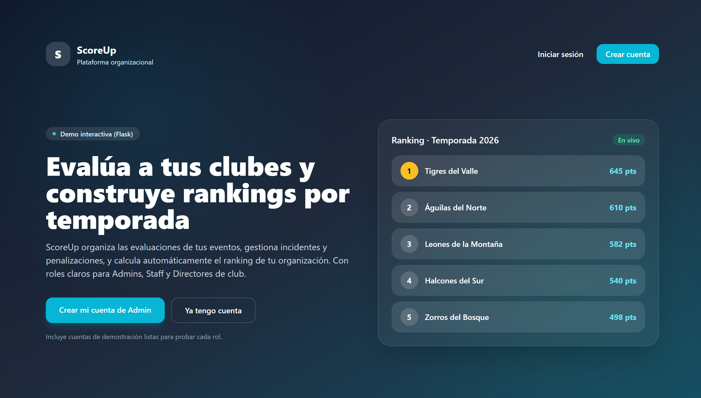
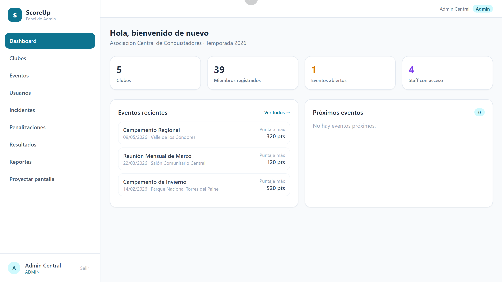
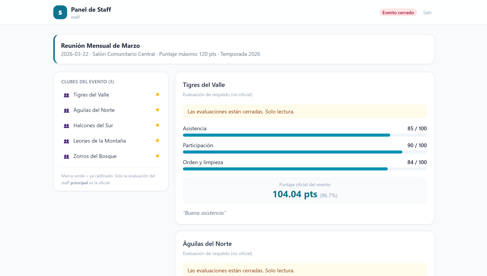

# ScoreUp — Sistema de Evaluación de Clubes de Conquistadores

<p align="center">
  
</p>

> Plataforma web para registrar, evaluar y calificar el desempeño de clubes de Conquistadores (y organizaciones similares) en eventos y temporadas.

---

## Table of Contents

- [About](#about)
- [Features](#features)
- [Tech Stack](#tech-stack)
- [Architecture](#architecture)
- [Project Structure](#project-structure)
- [Getting Started](#getting-started)
- [Configuration](#configuration)
- [Security](#security)
- [How to Contribute?](#how-to-contribute)
- [What's Next?](#whats-next)
- [License](#license)
- [Acknowledgements](#acknowledgements)
- [Author](#author)

---

## About

ScoreUp centraliza la información que hoy se maneja en planillas y hojas de cálculo: los administradores configuran eventos con criterios ponderados, el staff de cada evento evalúa a los clubes asignados, se registran incidentes y penalizaciones, y el sistema calcula automáticamente el **ranking por evento** y el **ranking de temporada**, con exportación a **Excel** y **PDF**.

### Panel de administrador

<p align="center">
  
</p>

El administrador gestiona la organización completa: crea clubes, eventos, criterios y usuarios; supervisa incidentes, penalizaciones y resultados, y exporta los rankings oficiales.

### Panel del staff evaluador

<p align="center">
  
</p>

El staff evalúa a los clubes de su evento asignando un valor 0–100 por cada criterio, reporta incidentes y aplica penalizaciones.

---

## Features

- **Organización y usuarios** — Registrar una organización con su Admin inicial; roles con permisos: `admin`, `staff`, `director`.
- **Clubes y miembros** — Crear, renombrar y eliminar clubes; registrar miembros y **importarlos desde Excel**.
- **Eventos y criterios** — Crear eventos (fecha, lugar, tipo, temporada, puntaje máximo) y configurar criterios de evaluación con peso en %. El evento **solo puede cerrarse si los pesos suman 100 %**.
- **Evaluación** — El staff registra valores 0–100 por criterio más un comentario por club. Se identifica la **evaluación oficial** (la del staff principal) y los respaldos.
- **Incidentes y penalizaciones** — Catálogo de motivos de descuento, aplicación/anulación de penalizaciones y registro de incidentes con **evidencia fotográfica** y filtros por evento, club, tipo, gravedad y estado.
- **Resultados** — Ranking por evento (con desempate según el criterio de mayor peso) y ranking de temporada (puntaje bruto − penalizaciones). Exportación a **Excel** y **PDF**.
- **Directores** — Consultan solo la posición y los puntajes de su propio club.
- **Generación de accesos** — Creación masiva de usuarios Staff y Directores con contraseñas aleatorias, o importación desde Excel.

---

## Tech Stack

| Categoría | Tecnología |
|---|---|
| **Lenguaje** | Python 3.10+ |
| **Framework web** | Flask + Jinja2 |
| **Estilos** | Tailwind CSS (CDN) |
| **Base de datos** | SQLite (persistencia vía repositorio propio) |
| **Excel** | openpyxl (importación/exportación) |
| **PDF** | ReportLab |
| **Seguridad** | Werkzeug (hash de contraseñas) |

---

## Architecture

Aplicación monolítica en capas (interfaz → casos de uso → dominio → repositorio), coherente con los principios **SOLID** y los patrones **Repository** y **Factory**:

```
    Admin · Staff · Director
              │
        ┌─────▼──────┐
        │  Interfaz  │  templates/ (Jinja2) + app.py
        └─────┬──────┘
        ┌─────▼──────┐
        │ Casos uso  │  app.py (rutas, sesión, control por rol)
        └─────┬──────┘
        ┌─────▼──────┐
        │  Dominio   │  data.py (entidades) + calc.py (lógica de negocio)
        └─────┬──────┘
        ┌─────▼──────┐
        │ Acceso a   │  persist.py (repositorio)
        │  datos     │
        └─────┬──────┘
              ▼
        ┌───────────┐
        │  SQLite   │  scoreup.db
        └───────────┘
```

| Módulo | Responsabilidad |
|---|---|
| `app.py` | Rutas HTTP, autenticación, control de acceso por rol y casos de uso |
| `data.py` | Entidades de dominio (`dataclasses`): Club, Usuario, Evento, Evaluación… |
| `calc.py` | Reglas de negocio: porcentaje ponderado, puntaje, rankings y desempates |
| `persist.py` | Repositorio (Adapter sobre SQLite): guarda y recarga todo el estado |
| `templates/` | Vistas web con Jinja2 + Tailwind |
| `static/` | Archivos estáticos (imágenes subidas de incidentes) |

---

## Project Structure

```
scoreup/
├── app.py               # Aplicación Flask y rutas
├── calc.py              # Cálculos y rankings
├── data.py              # Entidades de dominio (dataclasses)
├── persist.py           # Persistencia SQLite
├── requirements.txt     # Dependencias
├── README.md            # Este documento
├── documents/           # Propuesta académica del proyecto
├── image/               # Capturas de pantalla del sistema
├── templates/           # Plantillas Jinja2
│   ├── admin/           #   Panel de administrador
│   ├── staff/           #   Panel de staff evaluador
│   └── director/        #   Panel de director de club
└── static/              # Recursos estáticos (uploads)
```

---

## Getting Started

### 1. Requisitos

- Python 3.10 o superior
- (Opcional) `git`

### 2. Crear el entorno e instalar dependencias

```bash
# Windows (PowerShell)
py -m venv .venv
.venv\Scripts\activate

# Linux / macOS
python3 -m venv .venv
source .venv/bin/activate

pip install -r requirements.txt
```

### 3. Ejecutar

```bash
python app.py
```

Abre **http://127.0.0.1:5000** en tu navegador.

> La base de datos `scoreup.db` se crea automáticamente con datos de ejemplo en la primera ejecución (no está versionada en el repositorio).

---

## Configuration

### Variables de entorno

| Variable | Descripción | Valor por defecto |
|---|---|---|
| `FLASK_SECRET` | Clave secreta para firmar la sesión | Generada automáticamente (o `dev` en modo desarrollo) |
| `PORT` | Puerto del servidor | `5000` |

### Reglas de negocio

- La suma de los pesos de los criterios de un evento debe ser **100 %** para poder cerrarlo (`admin_evento_cerrar`).
- La evaluación oficial de un club es la del **staff principal** asignado en el evento.
- Los empates en el ranking de evento se resuelven comparando el valor en el **criterio de mayor peso**.
- El puntaje de temporada es **Σ puntajes por evento − Σ penalizaciones**.

---

## Security

- **Autenticación** por usuario y contraseña mediante sesión en servidor (cookie firmada con `FlaskSECRET`).
- **Contraseñas** almacenadas con hash seguro de Werkzeug (`scrypt`/`pbkdf2`), nunca en texto plano.
- **Control de acceso por rol**: decoradores `require_login` / `require_rol` protegen cada ruta y devuelven **403** ante accesos no autorizados.
- **Aislamiento multi-tenant**: cada organización solo ve sus propios clubes, eventos, evaluaciones y usuarios.
- **Validación de subidas**: solo se aceptan imágenes en formato `png`, `jpg`, `jpeg`, `gif`, `webp` para la evidencia de incidentes.

---

## How to Contribute?

1. Haz **fork** del repositorio.
2. Crea una rama para tu funcionalidad: `git checkout -b feature/mi-mejora`.
3. Realiza tus cambios y prueba que el flujo end-to-end siga funcionando (crear evento → evaluar → ranking → exportar).
4. Envía un **pull request** describiendo el cambio.

Toda contribución debe respetar la arquitectura en capas y las reglas de negocio documentadas.

---

## What's Next?

- Aplicación móvil nativa (Flutter).
- Notificaciones automáticas por correo o mensajería.
- Integración con sistemas institucionales externos.
- Módulo de pagos o inscripciones.
- Sistema de autoevaluación por parte de los clubes.
- Predicción de desempeño mediante Machine Learning.

---

## License

Proyecto académico para el Taller de Programación. Uso educativo, sin fines comerciales.

---

## Acknowledgements

- **Taller de Programación** — Ingeniería de Sistemas (4to semestre).
- Documento de referencia: **PROPUESTA_ScoreUp.md** (análisis, requerimientos, arquitectura y justificación del proyecto).

---

## Author

<p align="center">
  <b>ScoreUp</b> — Desarrollado por:
</p>

- Juan Fernando Nina Cachi
- Axel Alberto Ticona Villegas
- Kevin Quispe Canaviri
- Erick Lanchimba Lanchimba

<p align="center">
  <i>Ingeniería de Sistemas · Universidad — Taller de Programación</i>
</p>