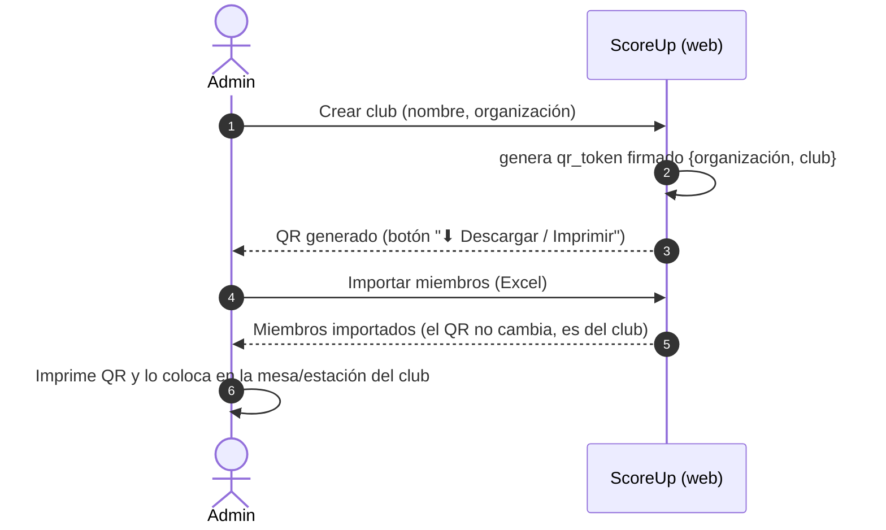
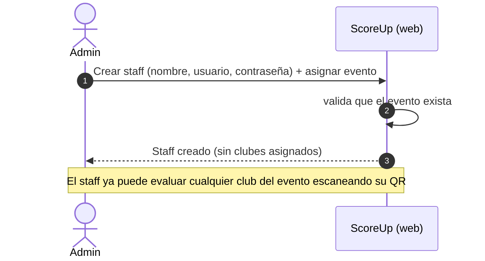
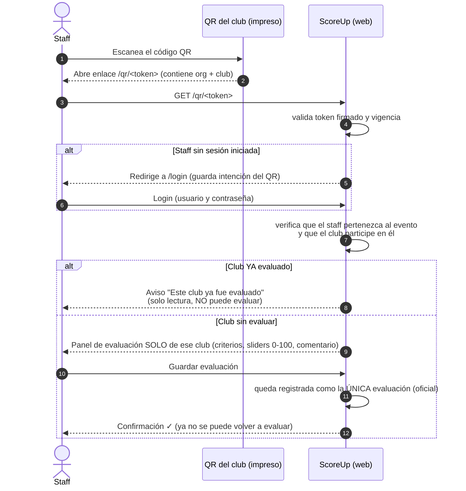
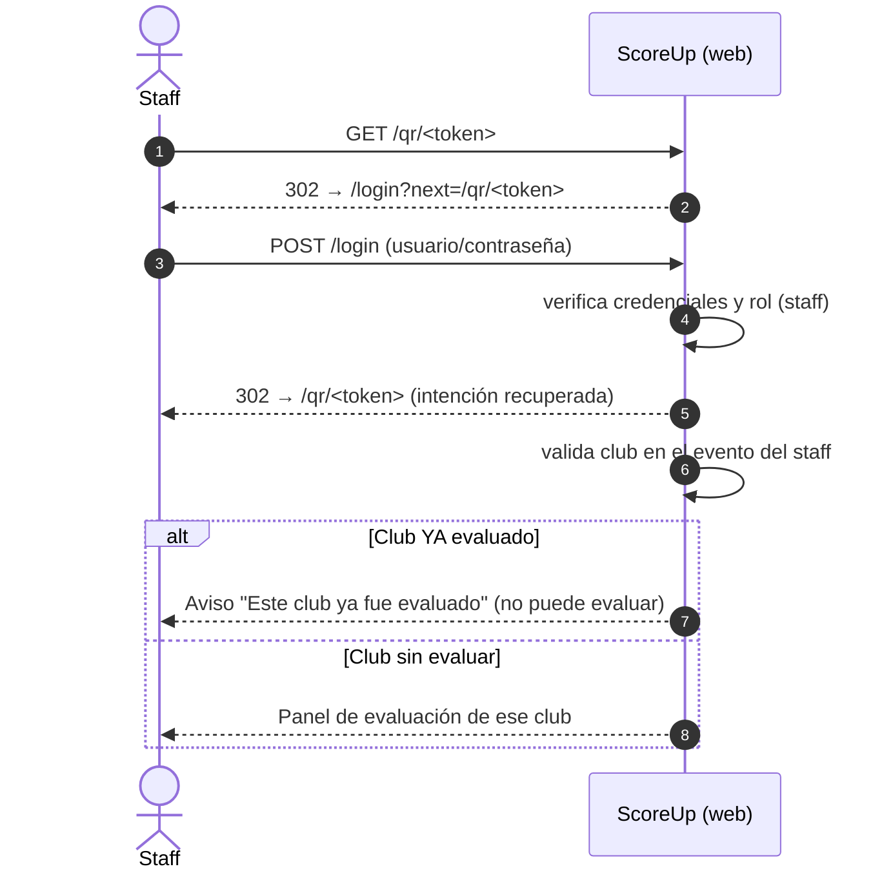

# ScoreUp — Manejo de QR por club (Diagramas de secuencia)

**Estado:** propuesta · **Válido para:** escenario "evento grande" donde asignar clubes a cada staff es tedioso.

## Cambio de flujo (resumen)

| | Antes | Ahora |
|---|---|---|
| Club ↔ Staff | Admin asigna `staff_principal_id` a cada club del evento | El QR del club identifica a qué club evaluar |
| Creación de staff | Se asigna nombre, usuario, contraseña y clubes | Solo nombre, usuario, contraseña y evento |
| Evaluación | El staff entra al panel y elige/clica el club | El staff **escanea el QR** del club y evalúa ese club |
| Evaluación oficial | Solo la del staff principal | El club se evalúa **una sola vez** (quien escanea y guarda primero) |
| Total temporada | Σ puntajes de eventos − penalizaciones | **Sin cambios** (se mantiene la fórmula) |

---

## Diagrama de secuencia 1 — Admin: crear club y generar su QR



---

## Diagrama de secuencia 2 — Admin: crear staff (sin asignar clubes)



---

## Diagrama de secuencia 3 — Staff: escanear QR y evaluar el club



---

## Diagrama de secuencia 3b — Variante: staff sin sesión (login + retorno al QR)



---

## Diagrama de clases / modelo de datos (cambios)

```mermaid
classDiagram
    class Club {
        +id: str
        +organizacion_id: str
        +nombre: str
        +categoria: str
        +qr_token: str  # NUEVO: token firmado {org, club}
    }

    class Usuario {
        +id: str
        +organizacion_id: str
        +nombre: str
        +username: str
        +password: str
        +rol: str  # admin | staff | director
        +evento_id: str  # solo staff (el "encargado")
        +club_id: str  # solo director
    }

    class EventoClub {
        +evento_id: str
        +club_id: str
        +staff_principal_id: str  # ELIMINADO
    }

    class Evaluacion {
        +id: str
        +evento_id: str
        +club_id: str
        +evaluador_id: str
        +valores: dict
        +comentario: str
    }

    EventoClub "1" --> "1" Club
    EventoClub "1" --> "1" Evaluacion : nota oficial = la ÚNICA evaluación permitida
    Usuario "1" --> "many" Evaluacion
    Evaluacion "1" --> "1" Club
```

---

## Rutas nuevas / modificadas

| Ruta | Método | Descripción |
|---|---|---|
| `/qr/<token>` | GET | Valida token, gestiona login pendiente y redirige al panel enfocado |
| `/admin/clubes/<id>/qr` | GET | Descarga/imprime la tarjeta QR del club |
| `/staff` | GET | Acepta `?club=<id>` para enfocar la evaluación de ese club |
| `POST /staff/evaluar/<club_id>` | POST | Sin cambios; el primer guardado marca notar oficial |

---

## Reglas de negocio que se mantienen / nuevas

1. La suma de pesos de criterios debe ser **100%** para cerrar un evento.
2. 🔒 **NUEVA:** Cada club solo puede ser evaluado **una sola vez**. Si el staff escanea y el club **ya fue evaluado**, no podrá evaluar (solo ve el aviso). El QR muestra 2 escenarios: *puede evaluar* (no evaluado aún) o *no puede evaluar* (ya evaluado).
3. La **única** evaluación guardada para un club es la oficial (alimenta el ranking). No hay respaldos ni "staff principal".
4. Empates en ranking: se compara el criterio de mayor peso.
5. **Duración del QR:** el QR es del club, no del staff ni del evento; puede tener vigencia (p.ej. se desactiva al cerrar el evento).
6. **Total temporada = Σ puntajes de eventos − penalizaciones/sanciones** (fórmula final, sin cambios).